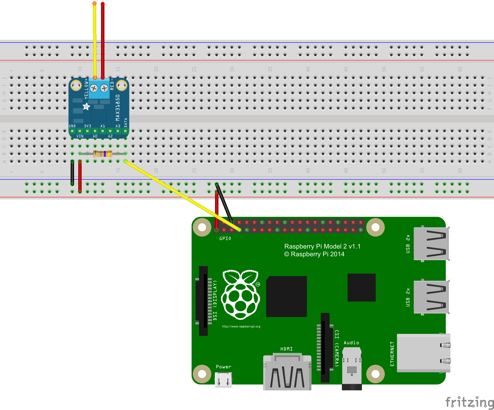
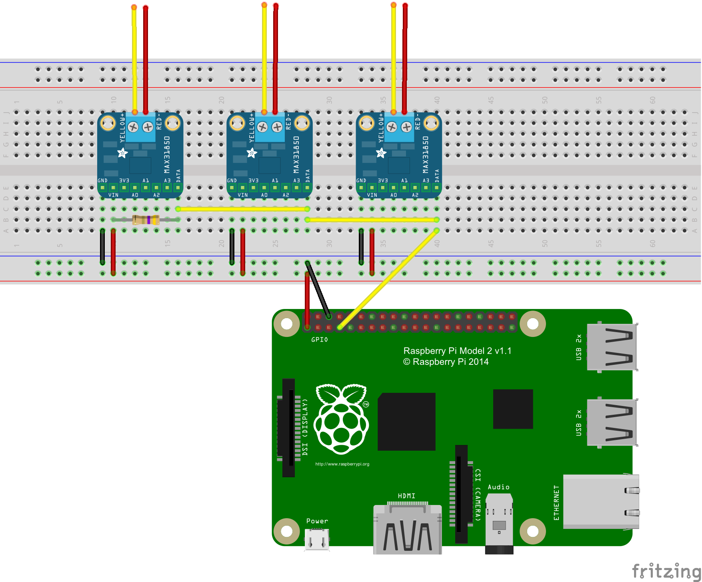
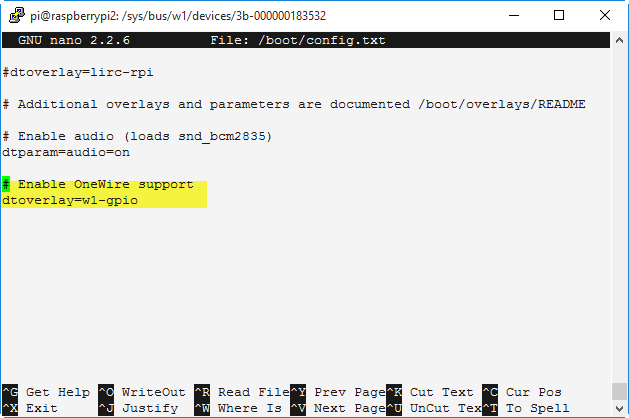
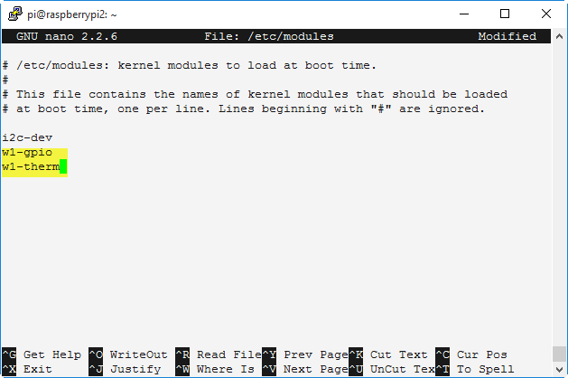
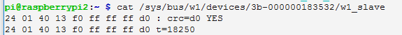

# Hometemp

A project to attach one or many MAX31850 Thermocouple Amplifiers to a Raspberry Pi

When I set out to use my Raspberry Pi to monitor temperature of my home radiant heating system using the MAX31850 Thermocouple Amplifier I was frustrated by poor examples.  Wiring photos and diagrams were anywhere from unclear to chaotic especially when showing how to wire multiple MAX31850's.  I have recreated my project several times over the last few years and have realized how poor my own documentation was so I was going through the same hassle over and over.  Now I am making my own documentation public to avoid this hassle in the future.  It is my hope that you will find this and it will save you from the headaches I experienced.   

To Do: As I work on my own project I will share code examples showing how to read the data output by the MAX31850 Thermocouple Amplifiers.
  
### Wiring

#### One MAX31850 Thermocouple Amplifier

Raspberry Pi	MAX31850	Wire Color
GND	(6)	GND (1)	Black
3V3	(1)	VIN (2)	Red
GPIO4 (7)	Data (8)	Yellow

Add a 4.7K resistor to connect the shared data line to 3V



##### Many MAX31850 Thermocouple Amplifiers

The wiring of many MAX31850 Thermocouple Amplifiers to a Raspberry Pi is essentially the same however you only use the single 4.7K resistor to connect the shared data lines to 3V as show in this diagram.



### Configure Raspberry Pi

The Raspberry Pi must be configured to support 1-Wire devices.
```
sudo nano /boot/config.txt
```
Append file with the following lines:

    # Enable OneWire support
    dtoverlay=w1-gpio



The Raspberry Pi must also be configured to load the drivers at startup.

```
sudo nano /etc/modules
```

Append file with the following lines:

    w1-gpio
    w1-therm



Reboot the Raspberry Pi

```
sudo reboot
```

Test that the drivers have loaded and the thermocouple amplifiers have been detected.

```
ls /sys/bus/w1/devices
```

You should see a list of your devices.


Test one of the devices
```
cat /sys/bus/w1/devices/3b-000000183532/w1_slave
```


